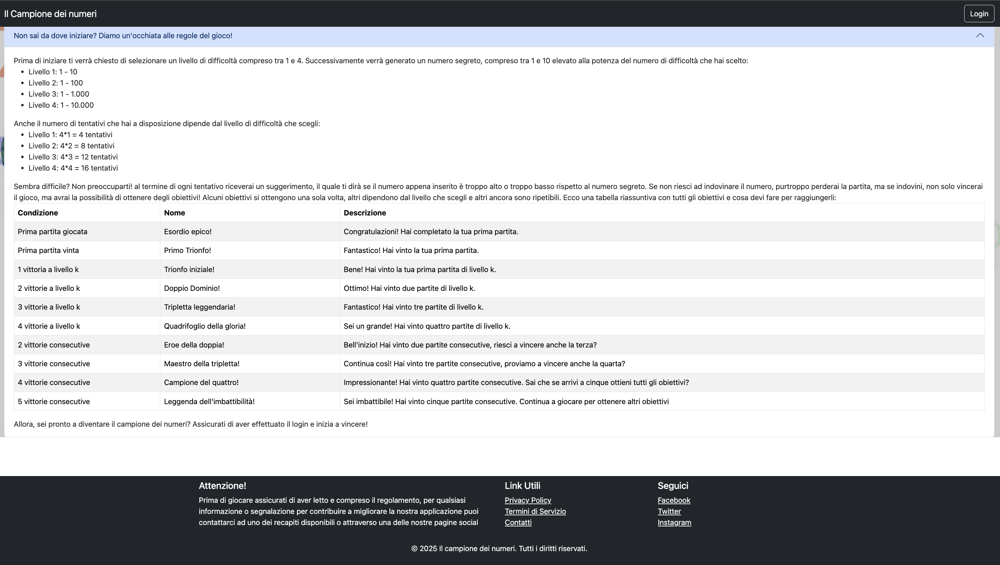
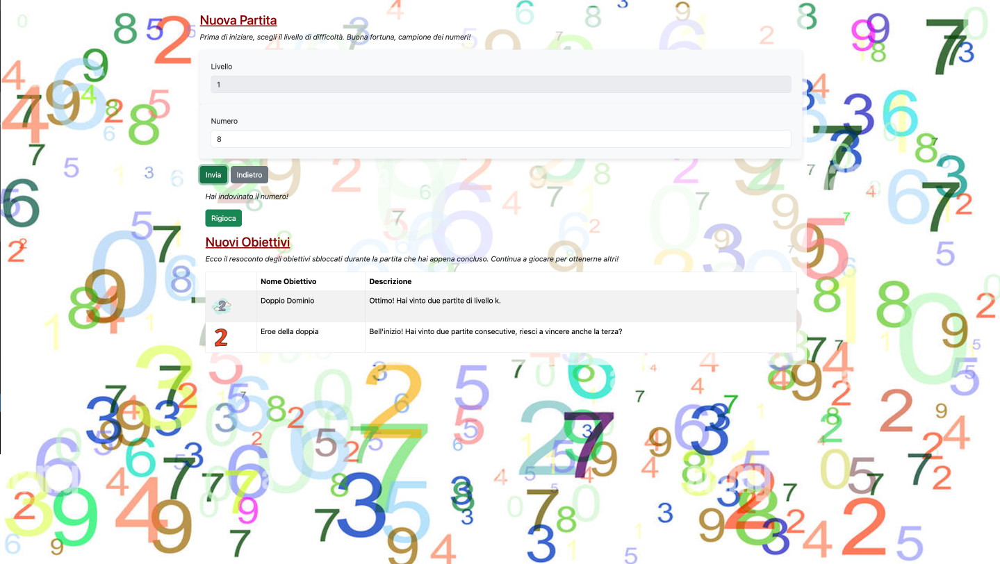
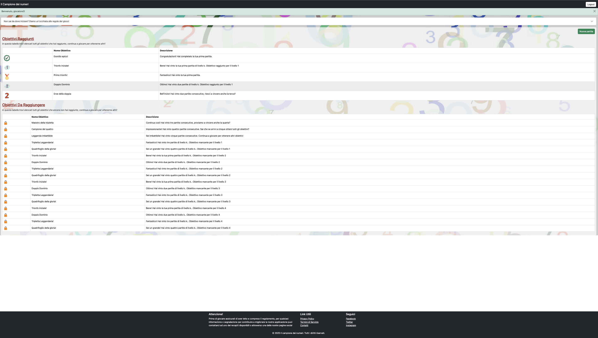

# Exam #4: "Obiettivi"
## Student: s329489 Verrone Paola 

## React Client Application Routes

- Route `/Homepage`: rappresenta la pagina iniziale dell'applicazione con una dettagliata 
  spiegazione delle regole di gioco ed un bottone per dare la possibilità agli utenti anonimi di effettuare il login. Questa pagina ha lo scopo di informare l'utente su come funziona il gioco prima di loggarsi.

- Route `/login`: In questa pagina è contenuto il form che da all'utente la possibilità di 
  effettuare il login. L'utente viene reindirizzato a questa pagina ogni volta che preme il bottone "login" presente nella pagina precedentemente presentata. Lo scopo di questa route è di autenticare l'utente e, con esito positivo sul controllo delle credenziali, reindirizzarlo all'area personale mediante il tasto "login" alla fine del form. L'utente può anche scegliere di tornare alla pagina precedente premendo il bottone "cancel".

- Route `/:name`: A questa pagina possono accedere solo gli utenti loggati, quindi coloro 
  che alla route precedentemente descritta hanno inserito delle credenziali corrette. L'obiettivo principale di questa pagina è quello di fornire all'utente una panoramica dettagliata della sua area riservata. L'utente ha la possibilità di chiudere la sessione mediante il bottone "Logout", per poi essere reindirizzato alla pagina con route "/Homepage". Sucessivamente l'utente loggato ha la possibilità di consultare lo stesso blocco di informazioni e regole presentato in "/Homepage", in questo caso presentato nel componente accordion compresso che può essere esteso e ricompresso ad ogni clic effettuato dall'utente. Subito dopo si ha il bottone "Nuova partita", il quale reindirizza l'utente ad una nuova pagina per poter svolgere l'attività di gioco, e in seguito si hanno due tabelle: "Obiettivi raggiunti" e "obiettivi da raggiungere". Esattamente come si intuisce dai titoli, la prima tabella ha lo scopo di informare l'utente di tutti gli obiettivi che ha ottenuto fino a quel momento, mentre la seconda tabella comprende tutti gli obiettivi che ancora devono essere raggiunti dall'utente.

- Route `/:name/NuovaPartita`: anche questa pagina è accessibile solo da un utente loggato, in particolare 
quando preme il bottone "Nuova partita" nella sua area personale (ovvero la route precedentemente descritta). In questa pagina, inizialmente abbastanza semplice, l'utente loggato ha la possibilità di effettuare il gioco, attraverso una banale ed intuitiva compilazione di un form. Inizialmente l'utente deve scegliere un livello di difficoltà e ha solo 4 alternative, da 1 a 4. Una volta scelto il livello, questo campo si disabilita e l'utente potrà giocare anche più di una partita, ma sempre dello stesso livello selezionato la prima volta. Per poter cambiare livello di difficoltà, l'utente deve tornare nell'area personale (premendo il bottone "indietro") e riaprire la route `/NuovaPartita`(premendo il bottone "Nuova partita" descritto nell'area personale). Dopo aver selezionato il livello, il server genera un numero segreto e l'utente può tentare di indovinarlo sin da subito, scrivendo il tentativo nel secondo campo del form. Ogni volta che l'utente preme il tasto "invia", sta effettuando un tentativo, e ogni volta viene rapidamente informato dal server se il numero che ha scelto è maggiore o minore del numero segreto, insieme al numero di tentativi rimanenti prima della fine della partita. Se l'utente indovina il numero viene notificato dal server, se l'utente non indovina il numero segreto, dopo l'invio dell'ultimo tentativo, il server gli informa che ha terminato la partita e gli svela il numero segreto. A prescindere dall'esito della partita, dopo un secondo (ritardo impostato volutamente per poter dare al server la possibilità di aggiornare i campi della tabella in interesse prima che il client chiami l'api in questione per riempire la tabella con questi dati) dal termine della partita appare sotto al form di gioco la tabella "Nuovi Obiettivi", la quale ha l'obiettivo di notificare all'utente se e quali obiettivi ha raggiunto giocando quest'ultima partita. 
Nel form di gioco sono presenti due bottoni: "indietro", che l'utente può premere in qualsiasi momento per poter ritornare nell'area riservata e lo può fare anche durante una partita in corso (in questo caso non verrà registrato nessun progresso e risulterà come se la partita non sia mai stata avviata), e il bottone "invia", (il quale è stato già descritto precedentemente) che serve per inviare il tentativo di indovinare il numero e al termine di ogni partita cambia in "Rigioca", dando all'utente in questo caso la possibilità di iniziare una nuova partita (mantenendo il livello di difficoltà impostato la prima volta).

- Route `*`: tutte le altre route non indirizzano a nessuna pagina, quindi viene caricata 
un'immagine "404 error" con lo scopo di informare l'utente che ha digitato una route sbagliata.

## API Server

- POST: `/api/sessions`
  Descrizione: Invia al server le credenziali dell'utente per effettuare il login 
  
  Request body: 
  {
    "username": "giocatore1@gmail.com",
    "password": "testtest"
  }
  Response: Se le credenziali sono corrette `201 created`, altrimenti `401 Unauthorized` 

- GET: `/api/sessions/current`
  Descrizione: Controlla se l'utente è ancora loggato 
  Response: se l'utente è ancora loggato `200 ok`, altrimenti `401 Unauthorized`

  Response body: 
  se Response: 201 
  {
  "username": "giocatore1@gmail.com",
  "name": "giocatore1"
  }

  se Response: 401 
  {
  "error": "Not authenticated"
  }

- DELETE: `/api/sessions/current`
  Descrizione: Chiude la sessione dell'utente
  Response: se la sessione è stata chiusa `200 ok`

- POST `/api/generaNumeroSegreto` 
  Descrizione: il server riceve il livello di difficoltà k e in base al suo valore genera numero segreto e numero di tentativi
  
  Request body:
  {
    "livello": 1
  }
  
  Response: il livello sarà sempre corretto perché viene controllato nel form, quindi se l'utente è loggato `200 ok`, altrimenti `401 Unauthorized`(Unauthorized)
  
  Response body:
  se Response: 200
  {
  "numeroSegreto": 10,
  "maxTentativi": 4
  }

  se Response: 401
  {
  "error": "Not Authorized"
  }

- POST `/api/inviaTentativo` 
  Descrizione: il server riceve dal client il numero che l'utente ha digitato nel form come tentativo per indovinare il numero segreto 

  Request Body:
  {
    "numero": 10
  }

  Response: se il tentativo viene ricevuto correttamente `200 ok`, altrimenti `401 Unauthorized`(Unauthorized)

  Response body:
  se Response: 401
  {
  "error": "Not Authorized"
  }

  se Response: 200, in base al confronto con il numero segreto: 
  {
    "messaggio": "Il numero inserito è minore del numero segreto."
  }
  oppure 
  { 
    messaggio: 'Hai indovinato il numero!' 
  }
  oppure 
  { 
    messaggio: 'Il numero inserito è minore del numero segreto.' 
  }

- GET `/api/utente` 
  Descrizione: restituisce le informazioni riguardanti l'utente loggato

  Response: se trova le informazioni `200 ok`, altrimenti `401 Unauthorized`, se si verifica un errore dal server `500 Internal server error`

  Response body: 
  se response: 200
  [
    {
      "username": "giocatore1",
      "partiteGiocate": 2,
      "partiteVinte": 2,
      "partiteConsecutive": 2
    }
  ]
  
  se response : 401
  {
    "error": "Not Authorized"
  }

  se response: 500
  {
    "error": "Errore durante il recupero delle informazioni utente"
  }

- PUT `/api/utenti/:name/PartiteGiocate` 
  Descrizione: aggiorna il numero di partite giocate  dell'utente (partiteGiocate + 1)

  Request: application/json data (?) 
  
  Response: se aggiorna correttamente `200 ok`, altrimenti `401 Unauthorized`, se si verifica un errore dal server `500 Internal server error`

  Response body:
  se response: 200
  {
  "message": "Partita giocata aggiunta con successo."
  }   

  se response: 401
  {
    "error": "Not Authorized"
  }

  se response: 500
  {
  "message": "Si è verificato un errore durante l'aggiunta della partita giocata."
  }

- PUT `/api/utenti/:name/PartiteVinte` 
  Descrizione: aggiorna il numero di partite vinte  dell'utente (partiteVinte + 1)

  Request: application/json data (?) 
  
  Response: se aggiorna correttamente `200 ok`, altrimenti `401 Unauthorized`, se si verifica un errore dal server `500 Internal server error`

  Response body:
  se response: 200
  {
  "message": "Partita vinta aggiunta con successo."
  }   

  se response: 401
  {
    "error": "Not Authorized"
  }

  se response: 500
  {
  "message": "Si è verificato un errore durante l'aggiunta della partita vinta."
  }

- PUT `/api/utenti/:name/resetConsecutive` 

  Descrizione: resetta il numero di partite consecutive  dell'utente (partiteConsecutive = 0)

  Request: application/json data (?) 
  
  Response: se aggiorna correttamente `200 ok`, altrimenti `401 Unauthorized`, se si verifica un errore dal server `500 Internal server error`

  Response body:
  se response: 200
  {
  "message": "Partite consecutive resettate con successo."
  }   

  se response: 401
  {
    "error": "Not Authorized"
  }

  se response: 500
  {
  "message": "Si è verificato un errore durante il reset delle partite consecutive."
  }

- PUT `/api/utenti/:name/PartiteVinteLivello` 
  Descrizione: Nella tabella user è presente una colonna per ogni livello (livello1, livello2, livello3, livello4). Questi campi servono per tenere il conto di quante partite sono state vinte per ogni livello. Attraverso questa api si aggiorna il conteggio.

  Request body:
  {
  "livello": 3
  }
  
  Response: se aggiorna correttamente `200 ok`, altrimenti `401 Unauthorized`, se si verifica un errore dal server `500 Internal server error`

  Response body:
  se response: 200
  {
  "message": "numero di partite vinte per livello aggiornato con successo."
  }   

  se response: 401
  {
    "error": "Not Authorized"
  }

  se response: 500
  {
  "message": "Si è verificato un errore durante l\'aggiornamento del numero di partite vinte per livello."
  }

- GET `/api/obiettivi`
  Descrizione: restituisce l'elenco di tutti gli obiettivi 

  Response: se trova l'elenco `200 ok`, altrimenti `401 Unauthorized`, se si verifica un errore dal server `500 Internal server error`

  Response body: 
  se response: 200
  [
    {
      "nome": "Esordio epico!",
      "descrizione": "Congratulazioni! Hai completato la tua prima partita."
    },
    {
      "nome": "Primo trionfo!",
      "descrizione": "Fantastico! Hai vinto la tua prima partita."
    },
  ...
  ]
  
  se response : 401
  {
    "error": "Not Authorized"
  }

  se response: 500
  {
    "error": "Errore durante il recupero degli obiettivi"
  } 

- GET `/api/utenti/:name/obiettiviUtente` 
  Descrizione: restituisce l'elenco di tutti gli obiettivi raggiunti dall'utente loggato

  Response: se trova l'elenco `200 ok`, altrimenti `401 Unauthorized`, se si verifica un errore dal server `500 Internal server error`

  Response body: 
  se response: 200
  [
    {
    "id": 393,
    "user": "giocatore1",
    "obiettivo": "Trionfo iniziale!",
    "descrizione": "Bene! Hai vinto la tua prima partita di livello k. Obiettivo raggiunto per il livello 2",
    "icona": "https://img.icons8.com/dusk/64/1-circle.png"
  },
  {
    "id": 394,
    "user": "giocatore1",
    "obiettivo": "Esordio epico!",
    "descrizione": "Congratulazioni! Hai completato la tua prima partita.",
    "icona": "https://img.icons8.com/doodle/48/ok.png"
  },
  ...
  ]
  
  se response : 401
  {
    "error": "Not Authorized"
  }

  se response: 500
  {
    "error": "Errore nel recupero degli obiettivi raggiunti dal giocatore"
  }

- GET `/api/utenti/:name/obiettiviUtente/obiettiviNuovi` 
  Descrizione: restituisce l'elenco di tutti gli obiettivi raggiunti dall'utente loggato durante l'ultima partita 

  Response: se trova l'elenco `200 ok`, altrimenti `401 Unauthorized`, se si verifica un errore dal server `500 Internal server error`

  Response body: 
  se response: 200
  [
    
    {
      "id": 394,
      "user": "giocatore1",
      "obiettivo": "Esordio epico!",
      "descrizione": "Congratulazioni! Hai completato la tua prima partita.",
      "icona": "https://img.icons8.com/doodle/48/ok.png"
    },
    {
      "id": 395,
      "user": "giocatore1",
      "obiettivo": "Primo trionfo!",
      "descrizione": "Fantastico! Hai vinto la tua prima partita.",
      "icona": "https://img.icons8.com/color/48/gold-medal--v1.png"
    },
    ...
  ]
  
  se response : 401
  {
    "error": "Not Authorized"
  }

  se response: 500
  {
    "error": "Errore nel recupero degli obiettivi appena raggiunti dal giocatore"
  }

- POST `/api/utenti/:name/obiettiviUtente/checkAddObiettivoGiocata`
  Descrizione: controlla i requisiti ed eventualmente aggiunge all'elenco degli obiettivi "prima partita giocata"
  
  Response: se funziona correttamente `200 ok`, altrimenti `401 Unauthorized`, se si verifica un errore dal server `500 Internal server error`

  Response status:
    se response: 200
  {
    "message": "Obiettivo "Prima partita giocata" controllato e aggiunto con successo."
  }
  oppure 
  {
    "message": "Obiettivo "Prima partita giocata" già ottenuto."
  }
  oppure 
  {
    "message": "Requisiti insufficienti per l'obiettivo "Prima partita giocata"."
  }
  se response: 401
  {
    "error": "Not Authorized"
  }

  se response:500
  { 
    "error": "Si è verificato un errore durante il controllo e l'aggiunta dell'obiettivo "Prima partita giocata"
  } 

- POST `/api/utenti/:name/obiettiviUtente/checkAddObiettivoVinta` 
  Descrizione: controlla i requisiti ed eventualmente aggiunge all'elenco degli obiettivi raggiunti dall'utente "Prima partita vinta"
  
  Response: se funziona correttamente `200 ok`, altrimenti `401 Unauthorized`, se si verifica un errore dal server `500 Internal server error`

  Response status:
    se response: 200
  {
    "message": "Obiettivo "Prima partita vinta" controllato e aggiunto con successo in base al livello."
  }
  oppure 
  {
    "message": "Obiettivo "Prima partita vinta" già ottenuto."
  }
  oppure 
  {
    "message": "Requisiti insufficienti per l'obiettivo "Prima partita vinta"."
  }
  se response: 401
  {
    "error": "Not Authorized"
  }

  se response:500
  { 
    "error": "Si è verificato un errore durante il controllo e l'aggiunta dell'obiettivo "Prima partita vinta"."
  }

- POST `/api/utenti/:name/obiettiviUtente/checkAddObiettivoConsecutive` 
  Descrizione: controlla i requisiti ed eventualmente aggiunge all'elenco degli obiettivi raggiunti dall'utente l'obiettivo "Partite consecutive"

  
  Response: se funziona correttamente `200 ok`, altrimenti `401 Unauthorized`, se si verifica un errore dal server `500 Internal server error`

  Response status:
    se response: 200
  {
    "message": "Obiettivo "Partite consecutive" controllato e aggiunto con successo in base al livello."
  }
  oppure 
  {
    "message": "Obiettivo "Partite consecutive" già ottenuto."
  }
  oppure 
  {
    "message": "Requisiti insufficienti per l'obiettivo "Partite consecutive"."
  }
  se response: 401
  {
    "error": "Not Authorized"
  }

  se response:500
  { 
    "error": "Si è verificato un errore durante il controllo e l'aggiunta dell'obiettivo "Partite consecutive"."
  }

- POST `/api/utenti/:name/obiettiviUtente/checkAddObiettivoLivello` 
  Descrizione: controlla i requisiti ed eventualmente aggiunge all'elenco degli obiettivi raggiunti dall'utente, uno o più obiettivi che dipendono dal livello di difficoltà
  
  Response: se funziona correttamente `200 ok`, altrimenti `401 Unauthorized`, se si verifica un errore dal server `500 Internal server error`

  Response status:
    se response: 200
  {
    "message": "Obiettivo controllato e aggiunto con successo in base al livello."
  }
  se response: 401
  {
    "error": "Not Authorized"
  }

  se response:500
  { 
    "error": "Si è verificato un errore durante il controllo e l'aggiunta dell'obiettivo in base al livello."
  }

- PUT `/api/utenti/:name/obiettiviUtente/resetNuovo` 
  Descrizione: azzera il campo "nuovo" nella tabella obiettivi_utente (nuovo = 0)
  
  Response: se aggiorna correttamente `200 ok`, altrimenti `401 Unauthorized`, se si verifica un errore dal server `500 Internal server error`

  Response body:
  se response: 200
  {
    "message": "campo "nuovo" resettato con successo."
  }
  se r
  esponse: 401
  {
    "error": "Not Authorized"
  }

  se response:500
  { 
    "error": "Si è verificato un errore durante il reset del campo nuovo."
  }

- GET `api/utenti/:name/obiettiviUtente/obiettiviProssimi` 
  Descrizione: restituisce la lista di tutti gli obiettivi che l'utente non ha ancora raggiunto 

  Response: se trova le informazioni `200 ok`, altrimenti `401 Unauthorized`, se si verifica un errore dal server `500 Internal server error`

  Response body: 
  se response: 401
  {
    "error": "Not Authorized"
  }

  se response:500
  { 
    "error": "Errore nel recupero degli obiettivi prossimi"
  }

  se response: 200
  [
    {
      "id": 8,
      "obiettivo": "Maestro della tripletta",
      "descrizione": "Continua così! Hai vinto tre partite consecutive, proviamo a vincere anche la quarta?"
    },
    {
      "id": 9,
      "obiettivo": "Campione del quattro",
      "descrizione": "Impressionante! Hai vinto quattro partite consecutive. Sai che se arrivi a cinque ottieni tutti gli obiettivi?"
    },
    ...
  ]

## Tabelle nel Database

- Tabella `user` - Questa tabella ha l'obiettivo di raccogliere tutte le informazioni degli utenti, tra cui dati personali e statistiche di gioco. ogni riga corrisponde ad un utente
contiene: id, name, email, password, salt, partiteGiocate, partiteVinte, partiteConsecutive,livello1, livello2, livello3, livello4

- Tabella `obiettivo` - Questa tabella ha lo scopo di raccogliere tutte le informazioni relative agli obiettivi. Ogni riga corrisponde ad un obiettivo
contiene: id, nome, descrizione

- Tabella `obiettivi_utente` - Questa tabella ha lo scopo di raccogliere l'elenco di tutti gli obiettivi raggiunti raccolti da tutti gli utenti. 
contiene: id, userId, obiettivo, descrizione, nuovo, icona, livello

## Principali componenti React 

- `AuthComponents` (in `App.jsx`): Il componente AuthComponents contiene LoginForm e LogoutButton, i quali sono progettati per gestire l’autenticazione degli utenti nell'applicazione, fornendo un’interfaccia utente per il login e per il logout.
	Il LoginForm permette agli utenti di inserire le proprie credenziali (email e password) per accedere all’applicazione. Una volta che l’utente ha effettuato il login con successo, il modulo  mostra un messaggio di saluto e un pulsante login cambia in logout, viceversa effettuando il logout.

- `Partita` (in `App.jsx`): Questo componente è progettato per gestire la logica del gioco. Permette ad un utente di indovinare un numero segreto generato dinamicamente dal server. Se l’utente indovina il numero o raggiunge il limite massimo di tentativi, il gioco termina, mostrando gli obiettivi sbloccati durante la partita e in caso di perdita svela il numero segreto. Se il gioco non è ancora terminato, l’utente può inviare un nuovo tentativo e dopo ogni numero che invia al form viene notificato di quanti tentativi gli rimangono. Alla fine della partita il bottone utilizzato per inviare il tentativo cambia in "Rigioca", dando all'utente la possibilità di ripetere un'altra partita allo stesso livello e viene caricata una tabella con gli eventuali nuovi obiettivi ottenuti dall'utente.

- `Regole` (in `App.jsx`): Questo componente è progettato per visualizzare il regolamento del 
  gioco, che si adatta a seconda che l’utente sia loggato o meno. Utilizza un componente Accordion di Bootstrap per permettere all’utente di espandere o comprimere la sezione esclusivamente quando è loggato.

## Screenshot

## Users Credentials

- giocatore1@gmail.com, giocatore1 
- giocatore2@gmail.com, giocatore2
- giocatore3@gmail.com, giocatore3

